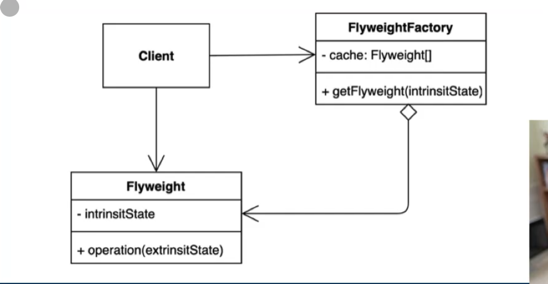

# 아이템1. 플라이웨이트패턴
### - 객체를 가볍게 만들어 메모리 사용을 줄이는 패턴
### - 자주 변하는 속성(또는 외적인 속성, extrinsit)과 변하지 않는 속성(또는 내적인 속성, inherit)을 분리하고 재사용하여 메모리 사용을 줄일 수 있다. 



```java
public class PontFactory {
    private Map<String, Font> cache = new HashMap<>();
    
    /**
     * @example FontFactory.getfont("nanum:12"); 
     */
    public static Font getFont(String font) {
        if (cache.containsKey(font)) {
            return cache.get(font);
        } else {
            String[] split = font.split(":");
            Font newFont = new Font(split[0], Integer.parseInt(split[1]));
            cache.put(font, newFont);
            return newFont;
        }
    }
}
```
